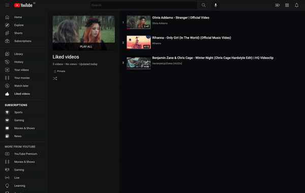

= YouTube Bulk Unlike
:author: David Wolf

Unlike all previously liked YouTube videos at once.

== Installation

Copy the contents of link:bookmarklet.txt[window=_blank] to your clipboard and paste into a new entry in your browser's bookmarks bar.

== Usage
. Open https://www.youtube.com/playlist?list=LL
. Execute the bookmarklet

NOTE: If there are private videos that are hidden from the normal liked videos list, you can open the list of private videos and re-execute the bookmarklet.

== Development

Build the https://en.wikipedia.org/wiki/Bookmarklet[bookmarklet] using the https://github.com/mrcoles/bookmarklet[bookmarlet] libary.

[source,zsh]
----
npm install
npm link bookmarklet
----

[source,zsh]
----
bookmarklet ./bookmarklet.js ./bookmarklet.txt
----

***

_This https://en.wikipedia.org/wiki/Bookmarklet[Bookmarklet] was scaffolded with the https://github.com/devidw/cookiecutter-bookmarklet[cookiecutter-bookmarklet] template._